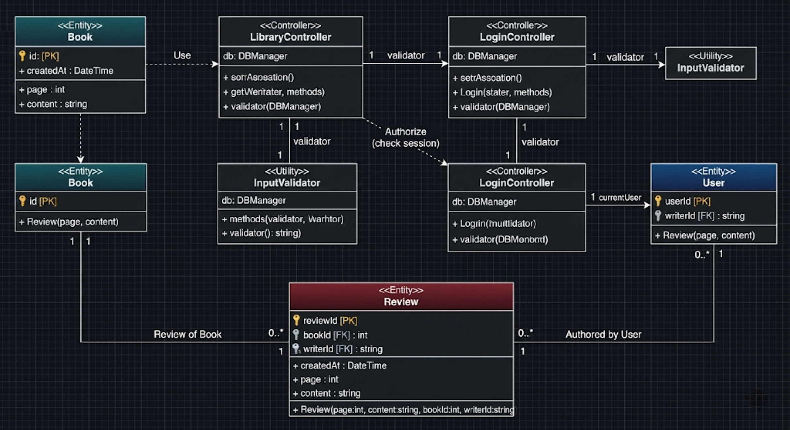

# Sync (신스): 페이지 기반 독서 한줄평 시스템

---

## 1. 최종 설계 목표 (Project Goals)
사용자가 독서 과정 중 특정 페이지에 대한 한줄 감상을 기록하고, 다른 사용자가 동일한 책을 읽을 때 해당 페이지 이전에 작성된 한줄평을 확인할 수 있는 프로그램 개발을 목표로 합니다.

* 실시간 교감: 독서 중 특정 문장이나 장면에서 느낀 생각을 즉각적으로 공유
* 스포일러 방지: 현재 읽고 있는 페이지를 기준으로 이전 감상만을 제공하여 자연스러운 독서 흐름 유지
* 독서 동기 부여: 타인의 반응과 공감을 통해 지속적인 독서 흥미 및 유대감 형성

## 2. 클래스 다이어그램 (Class Diagram)

* Book: 도서 정보 관리 (ID, 제목, 전체 페이지 등 정보 포함)
* Review: 페이지별 한줄평 기록 및 사용자 공감 데이터 저장
* User: 사용자 계정 정보 및 권한 관리
* Controller: Library 및 Login 로직을 제어하며 비즈니스 로직 수행
* InputValidator: 데이터 입력 시 유효성 검사 및 예외 처리 전담

---

## 3. 주요 기능 (Key Features)

* 책 관리 기능: 도서 제목 검색 및 DB 내 정보가 없는 경우 신규 도서 직접 등록
* 한줄평 등록 기능: 현재 읽고 있는 페이지 번호와 함께 실시간 감상 저장
* 한줄평 조회 기능: 입력 페이지 이하의 감상 중 가장 가까운 페이지의 데이터를 우선 제공
* 타임라인 뷰 (확장): 사용자가 원할 경우 현재 페이지 이전에 작성된 모든 한줄평을 목록 형태로 확인

---

## 4. 기술 스택 (Tech Stack)
* Language 및 Platform: C# 기반 윈도우 애플리케이션 개발
* Database: 데이터베이스 연동을 통한 도서 및 리뷰 데이터 CRUD 구현
* Data Handling: 객체 지향적 구조를 기반으로 한 효율적인 데이터 관리
* UI: 직관적인 검색 및 입력 인터페이스 구성

---

## 5. 팀원 및 역할 분담 (Team 및 Roles)
* 장서윤 : UI/UX 담당
    - UI 화면 구성 및 사용자 인터페이스 구현
* 김세연 : Algorithm 담당
    - 페이지 기준 한줄평 추천 알고리즘 구현
* 박시영 : Logic 담당
    - 책 검색, 등록 및 한줄평 저장 기능 로직 구현
* 하성연 : Database 담당
    - 데이터베이스 설계 및 데이터 저장, 조회 구현

---

## 6. 설계 추진 일정 (Milestone)
1. 6주차: 시스템 구조 설계, UI 기본 화면 구성, DB 테이블 생성
2. 7주차 ~ 8주차: 책 검색/등록 및 한줄평 작성/저장 기능 구현
3. 9주차: 한줄평 조회 기능 및 추천 알고리즘 구현
4. 10주차 ~ 12주차: 기능 통합 테스트 및 예외 처리 고도화
5. 13주차 ~ 15주차: 최종 사용자 테스트 및 프로젝트 발표

---